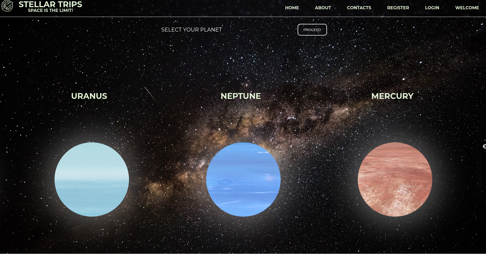
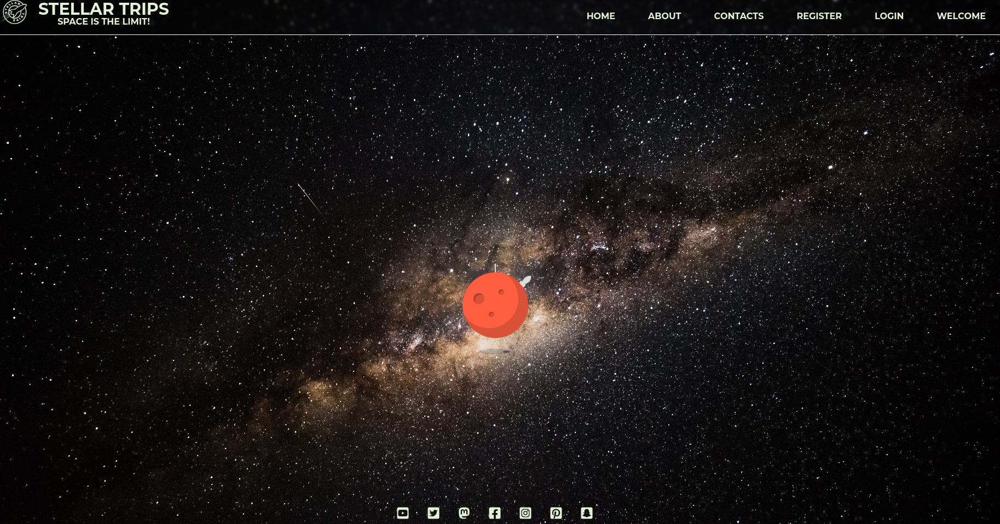
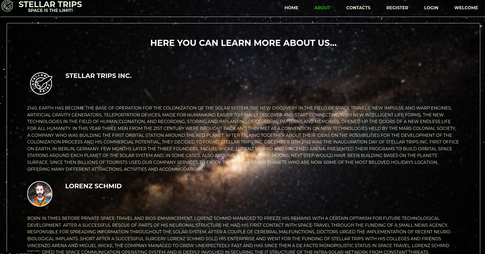
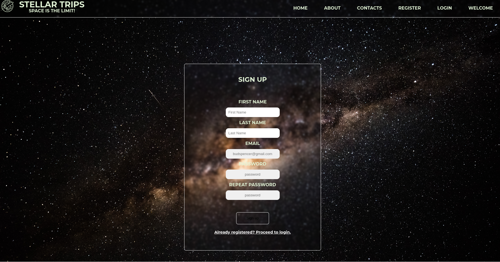
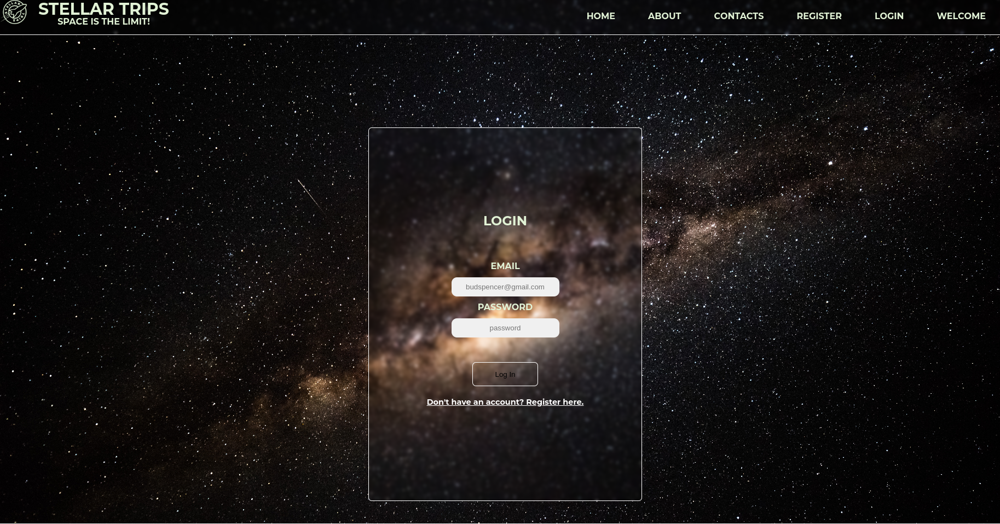
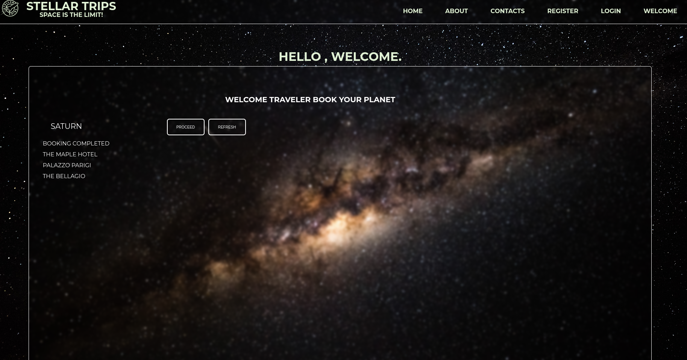

# STELLAR TRIPS - Space is the Limit!

**[Test this app yourself](github.io)**

---

### About Project

We imagined to be in a, maybe, not so distant future and to create a webapp for a Space Vacations company. We used our knowledge of the MERN stack to shape it.

### How to use this Project

As a common booking app, you can select the planet of our solar system you want to visit, and then the kind of vacation you like the most. Then you can register or login to finalize your purchase.

##### Developed With

- [x] _HTML5_
- [x] _CSS3_
- [ ] _SASS_
- [ ] _SCSS_
- [x] _JavaScript_
- [x] _React_
- [ ] _Bootstrap_
- [x] _npm_
- [x] _Node.js_

---

### Contacts

####Lorenz Schmid
Mail: <mighty.lo.schmid@gmail.com> 
GitHub: [Lorenzzschmid](https://github.com/Lorenzzschmid) 
LinkedIn: [Lorenz Schmid](https://www.linkedin.com/in/lorenz-schmid-0a8b8a24b/)

####Miguel Wicke
Mail: <mwicke@gmail.com> 
GitHub: [mfwicke](https://github.com/mfwicke) 
LinkedIn: [Miguel Wicke](https://www.linkedin.com/in/miguelwickeld/)

####Vincenzo Arena
Mail: <penninoematita@gmail.com> 
GitHub: [vincenzoarena](https://github.com/vincenzoarena) 
LinkedIn: [Vincenzo Arena](https://www.linkedin.com/in/vincenzo-arena-032a064b/)

---

### Used Tools

- [Slider](https://kenwheeler.github.io/slick/)
- [npm](https://www.npmjs.com/)
- [Google Fonts](https://fonts.google.com/)
- [Visual Studio Code](https://code.visualstudio.com/)
- [Trello](https://trello.com/)

---